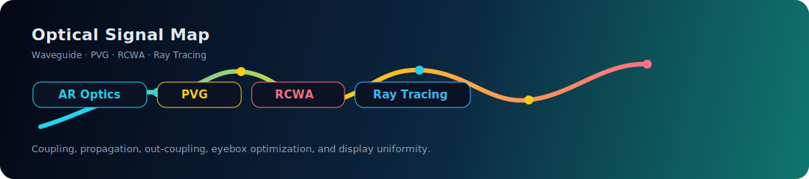
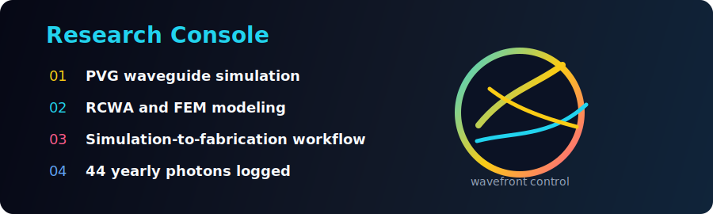

 

---

### ✦ Optical Systems · Diffractive Waveguides · Computational Imaging · AI-assisted Research ✦

  

  
  
  

## About Me

I'm currently working on **ray-tracing simulation and optimization of PVG-based diffractive optical waveguide AR display systems**.

I care about how light travels, folds, diffracts, couples, leaks, and finally becomes an image in front of the human eye.

- 🔭 Research focus: **AR waveguide design, PVG, diffractive optics, ray tracing**
- 🌱 Currently learning: **RCWA, COMSOL FEM, liquid crystal material optics**
- 🧪 Building toward: **simulation-to-fabrication workflows for waveguide displays**
- 👯 Open to collaborate on: **open-source optical simulation tools and AR/VR display optics**
- 💬 Ask me about: **PVG fundamentals, Python optical simulation, near-eye displays**
- 📫 Reach me: **907748779@qq.com**
- ⚡ Fun fact: **3 papers as an undergrad. Aiming for Nature & Science. No pressure.**

## Research Galaxy

<table>
  <tr>
    <td width="25%" align="center">
      
       
      <b>AR Optical Path</b>
       
      Coupling, propagation, out-coupling, eyebox optimization
    </td>
    <td width="25%" align="center">
      
       
      <b>Polarization Gratings</b>
       
      Diffraction behavior, LC optics, wavefront control
    </td>
    <td width="25%" align="center">
      
       
      <b>Rigorous Simulation</b>
       
      Electromagnetic modeling and grating analysis
    </td>
    <td width="25%" align="center">
      
       
      <b>Near-eye Display</b>
       
      Human vision, display optics, immersive systems
    </td>
  </tr>
</table>

## Tech Stack

### Languages

  
  
  
  
  

### Optical Simulation & Scientific Computing

  
  
  
  
  
  
  
  

### AI, Modeling & Development

  
  
  
  
  
  

### Tools

  

## Featured Projects

<table>
  <tr>
    <td width="50%">
      <h3>🧊 PVG Waveguide Ray-Tracing Simulation</h3>
      
<b>AR optical engine research</b>

      
Simulation and optimization workflow for PVG-based diffractive optical waveguide AR display systems, focusing on light propagation, coupling efficiency, and display uniformity.

      

        <code>Python</code>
        <code>Ray Tracing</code>
        <code>AR Optics</code>
        <code>PVG</code>
        <code>Waveguide</code>
      

    </td>
    <td width="50%">
      <h3>🌈 RCWA Grating Analysis Notes</h3>
      
<b>Electromagnetic diffraction modeling</b>

      
Personal implementation notes and numerical experiments for Rigorous Coupled-Wave Analysis, aimed at understanding diffraction behavior in periodic optical structures.

      

        <code>RCWA</code>
        <code>Diffraction</code>
        <code>Fourier Optics</code>
        <code>Numerical Methods</code>
      

    </td>
  </tr>
  <tr>
    <td width="50%">
      <h3>🔬 Liquid Crystal Optical Simulation</h3>
      
<b>Material optics and polarization control</b>

      
Exploration of liquid crystal optical behavior for polarization volume gratings, including refractive index modulation, polarization response, and FEM-based modeling.

      

        <code>Liquid Crystal</code>
        <code>COMSOL</code>
        <code>FEM</code>
        <code>Polarization</code>
      

    </td>
    <td width="50%">
      <h3>🥽 AR/VR Display Research Toolkit</h3>
      
<b>Future open-source direction</b>

      
Aiming to build reusable tools for AR/VR display optics simulation, visualization, wavefront analysis, and optimization from design to experimental validation.

      

        <code>AR</code>
        <code>VR</code>
        <code>XR</code>
        <code>Optimization</code>
        <code>Open Source</code>
      

    </td>
  </tr>
</table>

## Contribution Snake

  <picture>
    <source media="(prefers-color-scheme: dark)" srcset="https://raw.githubusercontent.com/lewen214/lewen214/output/github-contribution-grid-snake-dark.svg" />
    <source media="(prefers-color-scheme: light)" srcset="https://raw.githubusercontent.com/lewen214/lewen214/output/github-contribution-grid-snake.svg" />
    
  </picture>

## Connect with Me

  
  

---

<b>Chasing light, shaping wavefronts, and building tools for future AR displays.</b>

